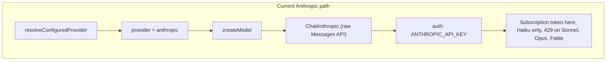
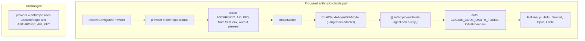
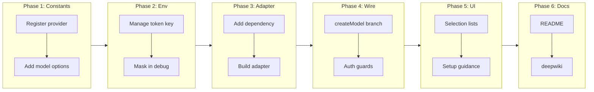

# Adopt the Claude Agent SDK as a Subscription-Authenticated Inference Provider

## Change Summary

OpenWiki's Anthropic path (`OPENWIKI_PROVIDER=anthropic`) authenticates a raw
`@langchain/anthropic` `ChatAnthropic` model with `ANTHROPIC_API_KEY`, i.e. the
raw Messages API. A Claude subscription OAuth token (`CLAUDE_CODE_OAUTH_TOKEN`,
generated with `claude setup-token`) used on that raw path is deliberately
capped to Haiku, with Sonnet, Opus, and Fable returning categorical `429`
errors. This change adds a new provider, `anthropic-claude`, that routes
inference through the `@anthropic-ai/claude-agent-sdk` runtime, which sends the
OAuth-sanctioned headers and therefore unlocks the full Claude model lineup
(Haiku, Sonnet, Opus, Fable) for subscription users, without altering the
existing API-key `anthropic` provider.

## Motivation and Background

OpenWiki's DeepAgents documentation agent consumes a LangChain chat model
(`createDeepAgent({ model })`). The project already models two distinct auth
flavors for a single vendor: `openai` (metered API key) and `openai-chatgpt`
(ChatGPT subscription via OAuth, reusing `ChatOpenAI` pointed at the Codex
backend). No equivalent subscription path exists for Anthropic.

Verified behavior (2026-06-17) makes the constraint concrete: the code path
determines model access when a subscription OAuth token is used.

- Agent SDK (`@anthropic-ai/claude-agent-sdk`) or the `claude` CLI runtime →
  full model access (Haiku, Sonnet, Opus, Fable). The runtime emits the
  OAuth-sanctioned headers.
- Raw Messages API (`@langchain/anthropic`, `@anthropic-ai/sdk`, `curl`) →
  Haiku only. Sonnet, Opus, and Fable return a categorical `429
  rate_limit_error` with no `retry-after`. A subscription token is
  intentionally not usable as a general API key.

Consequently, users who own a Claude subscription cannot reach Sonnet, Opus, or
Fable through OpenWiki today. Mirroring the `openai-chatgpt` precedent with an
Agent-SDK-backed provider closes that gap and keeps provider handling
consistent.

## Change Drivers

* Claude subscription holders cannot use Sonnet, Opus, or Fable for OpenWiki
  generation through the current raw Anthropic path.
* The `openai` vs `openai-chatgpt` precedent establishes a clear, expected
  pattern for a second, subscription-authenticated vendor flavor.
* `CLAUDE_CODE_OAUTH_TOKEN` interacts dangerously with a stale
  `ANTHROPIC_API_KEY` (the API key silently wins), which needs explicit,
  tested handling.

## Current State

Provider selection and model construction are centralized:

- `src/constants.ts` defines the `OpenWikiProvider` union, `PROVIDER_CONFIGS`
  (per-provider api-key env key, optional base URL, auth method, model
  options), `SELECTABLE_OPENWIKI_PROVIDERS`, and the resolution helpers
  `resolveConfiguredProvider`, `getDefaultModelId`, `getProviderApiKeyEnvKey`,
  `providerUsesOAuth`, etc.
- The `anthropic` provider is configured with `apiKeyEnvKey:
  ANTHROPIC_API_KEY`, an optional `ANTHROPIC_BASE_URL` override, and model
  options Haiku/Sonnet/Opus.
- `src/agent/index.ts::createModel()` branches per provider. The `anthropic`
  branch constructs `new ChatAnthropic(modelId, { apiKey, anthropicApiUrl?,
  maxRetries })` — the raw Messages API. The `openai-chatgpt` branch reuses
  `ChatOpenAI` pointed at the Codex backend with a Bearer token and custom
  headers/fetch, and refreshes OAuth tokens at startup.
- `src/env.ts` holds `MANAGED_ENV_KEYS` (the single source of truth persisted
  to `~/.openwiki/.env` at `0600`), from which the credential diagnostics list
  (`CREDENTIAL_DIAGNOSTIC_ENV_KEYS`) and the agent debug env dump
  (`DEBUG_ENV_KEYS`) are derived. Secret values are masked in diagnostics.
- `src/agent/index.ts::formatDebugValue()` masks `*_API_KEY` values to
  length-only, but any other secret longer than 10 chars is printed as a
  `first6...last4` preview.
- `src/credentials.tsx` and `src/cli.tsx` drive the onboarding and
  credential-editing UI from `SELECTABLE_OPENWIKI_PROVIDERS` and
  `getProviderModelOptions`.

### Current State Diagram



## Proposed Change

Introduce a new provider `anthropic-claude` (label "Anthropic (Claude
subscription)") that parallels `openai-chatgpt`. Rather than replacing the
existing `anthropic` provider, this is an additive second flavor, because the
raw API-key path remains valid for metered Anthropic API users and removing it
would break them.

The new provider:

1. Authenticates with `CLAUDE_CODE_OAUTH_TOKEN` (a subscription OAuth token
   produced by `claude setup-token`), stored in `~/.openwiki/.env`.
2. Routes inference through `@anthropic-ai/claude-agent-sdk`, exposed to
   DeepAgents through a thin LangChain-compatible chat-model adapter
   (`ChatClaudeAgentSdkModel`) so `createDeepAgent({ model })` consumes it
   unchanged — mirroring how `openai-chatgpt` reuses a LangChain model class.
3. Offers model options Sonnet (default), Opus, Haiku, and Fable, and accepts
   custom model IDs via `OPENWIKI_MODEL_ID`.
4. Guards against the `ANTHROPIC_API_KEY` footgun: when this provider is active,
   `ANTHROPIC_API_KEY` MUST NOT be forwarded into the Agent SDK runtime, and a
   warning MUST be emitted so the subscription token is used rather than the
   metered key.

The adapter isolates the Agent SDK behind the existing `createModel` seam. It
maps inbound LangChain messages (including DeepAgents' bound tool schemas) to a
single Agent SDK inference turn with the SDK's own agent loop and filesystem
tools disabled, and translates the streamed assistant output (text and
`tool_use` blocks) back into LangChain `AIMessageChunk`s carrying `tool_calls`,
preserving DeepAgents' own tool-calling loop.

### Proposed State Diagram



## Requirements

### Functional Requirements

1. **FR-1 (Provider registration).** The system **MUST** register a new
   provider `anthropic-claude` in `PROVIDER_CONFIGS`, the `OpenWikiProvider`
   union, and `SELECTABLE_OPENWIKI_PROVIDERS`, selectable via
   `OPENWIKI_PROVIDER=anthropic-claude`.
2. **FR-2 (SDK routing).** The system **MUST** route all `anthropic-claude`
   inference through `@anthropic-ai/claude-agent-sdk` and **MUST NOT** use the
   raw Messages API (`ChatAnthropic`) for this provider. The SDK **MUST** be
   exposed to DeepAgents as a LangChain-compatible chat model so
   `createDeepAgent({ model })` consumes it without modification.
3. **FR-3 (Model lineup).** The system **MUST** offer, for this provider, model
   options Sonnet (`claude-sonnet-5`), Opus (`claude-opus-4-8`), Haiku
   (`claude-haiku-4-5`), and Fable (`claude-fable-5`), with Sonnet as
   the default, and **MUST** accept a custom model ID via `OPENWIKI_MODEL_ID`
   validated by `isValidModelId`.
4. **FR-4 (Authentication).** The system **MUST** authenticate this provider
   using `CLAUDE_CODE_OAUTH_TOKEN` and **MUST NOT** require `ANTHROPIC_API_KEY`
   for it.
5. **FR-5 (Auto-detection, backward compatible).** The system **MUST**
   auto-select `anthropic-claude` when `CLAUDE_CODE_OAUTH_TOKEN` is set and no
   higher-precedence provider credential or `OPENWIKI_PROVIDER` override is
   present. It **MUST NOT** change the provider chosen for any existing user who
   has `OPENAI_API_KEY`, `OPENAI_COMPATIBLE_API_KEY`, `OPENROUTER_API_KEY`,
   `ANTHROPIC_API_KEY`, `BASETEN_API_KEY`, or `FIREWORKS_API_KEY` set.
6. **FR-6 (ANTHROPIC_API_KEY footgun).** When `anthropic-claude` is the active
   provider and `ANTHROPIC_API_KEY` is also present in the environment, the
   system **MUST NOT** forward `ANTHROPIC_API_KEY` into the Agent SDK runtime
   environment, and **MUST** emit a warning event stating that the subscription
   OAuth token is being used instead of the API key.
7. **FR-7 (Missing token).** When `anthropic-claude` is selected but
   `CLAUDE_CODE_OAUTH_TOKEN` is missing or empty, the system **MUST** fail fast
   with an actionable error that names the variable and references `claude
   setup-token`.
8. **FR-8 (Unsupported-path guidance).** When the Agent SDK rejects a requested
   model for authentication or path reasons, the system **MUST** surface a
   clear error explaining the token, model, and path relationship. When the raw
   `anthropic` provider returns a categorical `429` for a non-Haiku model, the
   system **MUST** translate it into guidance to switch to `anthropic-claude`
   with `CLAUDE_CODE_OAUTH_TOKEN`.
9. **FR-9 (Secret hygiene).** The system **MUST NOT** print
   `CLAUDE_CODE_OAUTH_TOKEN` in plaintext anywhere: the credential-diagnostics
   preview **MUST** be masked, and the agent debug env dump
   (`formatDebugValue`) **MUST** reduce it to length-only (not a
   `first6...last4` preview). The token **MUST** be persisted only to
   `~/.openwiki/.env` at mode `0600` via the managed-env mechanism.
10. **FR-10 (UI surface).** The onboarding and credential-editing UI **MUST**
    list `anthropic-claude` and its four models, and **MUST** present setup
    guidance instructing the user to run `claude setup-token` and paste the
    resulting token.
11. **FR-11 (Non-regression).** The system **MUST** leave the existing
    `anthropic` (raw API-key) provider and every other provider behavior
    unchanged.

### Non-Functional Requirements

1. **NFR-1 (Streaming).** The adapter **MUST** stream assistant tokens
   incrementally as the SDK yields them, so `agent.streamEvents(...)` continues
   to emit `text` events during generation.
2. **NFR-2 (Security).** The token **MUST** be treated as a secret at rest
   (`0600`) and in transit (sent only to Anthropic's endpoints via the SDK),
   and **MUST NOT** be committed to the repository or written to logs.
3. **NFR-3 (Retry parity).** The adapter **MUST** honor
   `OPENWIKI_PROVIDER_RETRY_ATTEMPTS` consistently with other providers.
4. **NFR-4 (Runtime compatibility).** The implementation **MUST** run on Node
   >= 20 as ESM, consistent with the project's `package.json` `engines` and
   `type: module`.

## Affected Components

* `src/constants.ts` — provider union, `PROVIDER_CONFIGS`,
  `SELECTABLE_OPENWIKI_PROVIDERS`, model options, `resolveConfiguredProvider`,
  new `CLAUDE_CODE_OAUTH_TOKEN_ENV_KEY`.
* `src/env.ts` — add the token to `MANAGED_ENV_KEYS` (persistence, masked
  diagnostics, debug-dump derivation).
* `src/agent/claude-agent-sdk.ts` — **new file**: SDK wrapper and
  `ChatClaudeAgentSdkModel` LangChain adapter, token detection,
  `ANTHROPIC_API_KEY` scrubbing, message/tool bridging, error mapping.
* `src/agent/index.ts` — new `createModel` branch, precedence warning, and
  categorical-`429` translation in the run error path.
* `src/credentials.tsx`, `src/cli.tsx` — provider/model selection and
  provider-specific setup guidance.
* `package.json` — add `@anthropic-ai/claude-agent-sdk` dependency.
* `README.md`, `.deepwiki` — documentation and DeepWiki reference. Note:
  `.deepwiki` does not yet exist in the repository, so Phases 3 and 6 **MUST**
  create it (not merely append to it).

## Scope Boundaries

### In Scope

* A new `anthropic-claude` provider backed by `@anthropic-ai/claude-agent-sdk`.
* `CLAUDE_CODE_OAUTH_TOKEN` detection, precedence, and error messaging.
* Full model lineup (Haiku, Sonnet, Opus, Fable) selection and defaults.
* Secret hygiene for the token in diagnostics and debug output.
* Onboarding/credentials UI entries and README/`.deepwiki` updates.

### Out of Scope ("Here, But Not Further")

* A browser-based OAuth login flow that mints the token inside OpenWiki. The
  token is generated out of band by `claude setup-token`; OpenWiki only
  consumes it. A captured-login flow is deferred.
* Automatic token refresh or expiry management. The token is treated as a
  long-lived secret the user rotates manually (unlike the `openai-chatgpt`
  refresh loop).
* Changes to the raw `anthropic` provider's behavior beyond the new
  `429`-translation guidance in FR-8.
* Adopting the Agent SDK's own agent loop, tools, or filesystem in place of
  DeepAgents. The SDK is used strictly for authenticated model inference.
* Regenerating OpenWiki wiki pages under `openwiki/` (produced by the scheduled
  workflow, not hand-edited).

## Alternative Approaches Considered

* **Reauthenticate the existing `ChatAnthropic` path with the OAuth token as a
  Bearer credential.** Rejected: the raw Messages API is categorically capped
  to Haiku for subscription tokens regardless of headers, so it cannot serve
  Sonnet, Opus, or Fable.
* **Shell out to the `claude` CLI per inference call.** Rejected: heavier
  process management, harder streaming and tool bridging, and a coarser error
  surface than the SDK.
* **Replace the `anthropic` provider outright.** Rejected: breaks existing
  metered API-key users; the additive second-flavor pattern matches the
  established `openai` / `openai-chatgpt` precedent.

## Impact Assessment

### User Impact

Claude subscription holders gain access to Sonnet, Opus, and Fable for OpenWiki
generation by running `claude setup-token` and selecting the new provider.
Existing users see no behavioral change unless they opt in.

### Technical Impact

Adds one runtime dependency (`@anthropic-ai/claude-agent-sdk`) and one adapter
module. The main technical risk is the fidelity of the LangChain-to-Agent-SDK
tool-calling bridge, isolated behind the `createModel` seam. No breaking
changes to existing providers.

### Business Impact

Broadens OpenWiki's addressable users to Claude subscribers without introducing
metered API spend, aligning with the existing subscription-based
`openai-chatgpt` option.

## Implementation Approach

### Phase 1 — Provider registration and constants

1. Add `export const CLAUDE_CODE_OAUTH_TOKEN_ENV_KEY = "CLAUDE_CODE_OAUTH_TOKEN"`.
2. Extend the `OpenWikiProvider` union and `SELECTABLE_OPENWIKI_PROVIDERS` with
   `anthropic-claude`.
3. Add its `PROVIDER_CONFIGS` entry: `apiKeyEnvKey:
   CLAUDE_CODE_OAUTH_TOKEN_ENV_KEY`, `label: "Anthropic (Claude subscription)"`,
   `modelOptions` ordered Sonnet, Opus, Haiku, Fable (Sonnet first, so it is the
   default via `getDefaultModelId`).
4. Extend `resolveConfiguredProvider` to return `anthropic-claude` when
   `CLAUDE_CODE_OAUTH_TOKEN` is set, placed immediately before the
   `DEFAULT_PROVIDER` fallback so no existing auto-detection changes.

*Affected components:* `src/constants.ts`.

### Phase 2 — Environment management and secret hygiene

1. Add `CLAUDE_CODE_OAUTH_TOKEN_ENV_KEY` to `MANAGED_ENV_KEYS` so it is
   persisted, masked in `CREDENTIAL_DIAGNOSTIC_ENV_KEYS`, and included in
   `DEBUG_ENV_KEYS` derivation.
2. In `src/agent/index.ts::formatDebugValue`, ensure
   `CLAUDE_CODE_OAUTH_TOKEN` is masked to `set(length=N)` rather than the
   `first6...last4` preview branch (it does not end in `_API_KEY`).
3. Confirm the diagnostics preview treats it as a secret (it is not in
   `isNonSecretDiagnosticKey`, so it is masked by default).

*Affected components:* `src/env.ts`, `src/agent/index.ts`.

### Phase 3 — Claude Agent SDK model adapter

1. Add `@anthropic-ai/claude-agent-sdk` to `package.json` dependencies.
2. Create `src/agent/claude-agent-sdk.ts` exporting `ChatClaudeAgentSdkModel`
   (a LangChain `BaseChatModel` adapter) that:
   - reads `CLAUDE_CODE_OAUTH_TOKEN`, throwing the FR-7 error when absent (a
     defense-in-depth fallback; the primary FR-7 error is emitted earlier by the
     `ensureProviderKey` guard per Phase 4, since that check runs before the
     adapter is constructed);
   - builds the SDK environment with `ANTHROPIC_API_KEY` removed (FR-6);
   - maps LangChain messages and bound tool schemas to a single SDK inference
     turn with the SDK's built-in agent loop and filesystem tools disabled;
   - translates streamed assistant output (text and `tool_use`) into
     `AIMessageChunk`s carrying `tool_calls`;
   - maps SDK auth/`429` failures to the FR-8 error message;
   - honors `maxRetries` from `OPENWIKI_PROVIDER_RETRY_ATTEMPTS`.
3. Validate the exact SDK API (`query()` options, tool-definition surface,
   streaming shape) against DeepWiki `anthropics/claude-agent-sdk` before
   finalizing, and record it in `.deepwiki`.

*Affected components:* `src/agent/claude-agent-sdk.ts`, `package.json`,
`.deepwiki`.

### Phase 4 — Wire into `createModel` and auth guards

1. Add an `anthropic-claude` branch to `createModel` returning
   `ChatClaudeAgentSdkModel`.
2. Emit the FR-6 precedence warning when both credentials are present (via the
   existing `emitDebug`/event mechanism).
3. In the run error path, translate a categorical `429` from the raw
   `anthropic` provider on a non-Haiku model into the FR-8 guidance.
4. Ensure the FR-7 actionable error is the one that actually surfaces.
   `ensureProviderKey` runs at `src/agent/index.ts:114`, before `createModel`
   (`src/agent/index.ts:164`) constructs the adapter, and its generic message
   (`"<KEY> is required to run OpenWiki with <label>."`) names the variable but
   does **NOT** reference `claude setup-token`. The system **MUST** special-case
   `anthropic-claude` in the presence check that fires first (`ensureProviderKey`
   or a guard invoked before it) so the emitted error both names
   `CLAUDE_CODE_OAUTH_TOKEN` and references `claude setup-token`, satisfying FR-7
   and AC-7. The adapter's own token check (Phase 3) then serves only as a
   defense-in-depth fallback for direct adapter construction.

*Affected components:* `src/agent/index.ts`.

### Phase 5 — Onboarding and credentials UI

1. Confirm the provider appears automatically from
   `SELECTABLE_OPENWIKI_PROVIDERS` and its models from
   `getProviderModelOptions`.
2. Add provider-specific setup guidance (paste a token from `claude
   setup-token`) in the api-key setup step for this provider.

*Affected components:* `src/credentials.tsx`, `src/cli.tsx`.

### Phase 6 — Documentation

1. Add a README "Anthropic (Claude subscription)" subsection and update the
   provider-list sentence.
2. Add `anthropics/claude-agent-sdk` to `.deepwiki`.

*Affected components:* `README.md`, `.deepwiki`.

### Implementation Flow



## Test Strategy

### Tests to Add

| Test File | Test Name | Description | Inputs | Expected Output |
|-----------|-----------|-------------|--------|-----------------|
| `test/constants.test.ts` | `registers anthropic-claude provider` | Provider is in `SELECTABLE_OPENWIKI_PROVIDERS` and `PROVIDER_CONFIGS` with the four models | provider id | present with Sonnet/Opus/Haiku/Fable options |
| `test/constants.test.ts` | `defaults anthropic-claude to Sonnet` | `getDefaultModelId("anthropic-claude")` returns Sonnet | provider id | `claude-sonnet-5` |
| `test/constants.test.ts` | `auto-detects token only as lowest precedence` | `resolveConfiguredProvider` returns `anthropic-claude` when only the token is set; returns prior providers when their keys are set | env maps | correct provider per FR-5 |
| `test/env.test.ts` | `token is a managed masked secret` | Token appears in `MANAGED_ENV_KEYS` and diagnostics preview is masked | env with token | masked preview, not plaintext |
| `test/claude-agent-provider.test.ts` | `createModel returns SDK adapter` | `createModel("anthropic-claude", ...)` yields `ChatClaudeAgentSdkModel` | provider, model id | adapter instance, not `ChatAnthropic` |
| `test/claude-agent-provider.test.ts` | `missing token throws actionable error` | Selecting provider without token fails fast | no token | error names variable and `claude setup-token` |
| `test/claude-agent-provider.test.ts` | `scrubs ANTHROPIC_API_KEY from SDK env` | With both set, SDK env excludes `ANTHROPIC_API_KEY` and a warning is emitted | both credentials | key absent from SDK env, warning event |
| `test/claude-agent-sdk.test.ts` | `bridges messages and tool calls` | Mocked `query()` stream maps to `AIMessageChunk` with `tool_calls` | mocked SDK stream | LangChain chunks with text and tool_calls |
| `test/claude-agent-sdk.test.ts` | `maps auth 429 to guidance error` | SDK auth/`429` failure maps to FR-8 message | mocked failure | error explains token/model/path |
| `test/redaction.test.ts` | `redacts CLAUDE_CODE_OAUTH_TOKEN in debug` | `formatDebugValue` returns length-only for the token | token value | `set(length=N)`, no `first6...last4` |

### Tests to Modify

| Test File | Test Name | Current Behavior | New Behavior | Reason for Change |
|-----------|-----------|------------------|--------------|-------------------|
| `test/env.test.ts` | env managed-keys snapshot/order test | Asserts current `MANAGED_ENV_KEYS` set | Includes `CLAUDE_CODE_OAUTH_TOKEN` | New managed key added |
| `test/credentials.test.ts` | provider-list rendering test | Lists current providers | Includes `anthropic-claude` and its models | New provider surfaced in UI |

### Tests to Remove

| Test File | Test Name | Reason for Removal |
|-----------|-----------|-------------------|
| Not applicable | — | No existing functionality is removed; all changes are additive. |

## Acceptance Criteria

### AC-1: Provider is registered and selectable (FR-1)

```gherkin
Given OpenWiki is configured
When OPENWIKI_PROVIDER is set to anthropic-claude
Then resolveConfiguredProvider returns anthropic-claude
  And the provider exposes model options Sonnet, Opus, Haiku, and Fable
```

### AC-2: Inference is routed through the Agent SDK (FR-2)

```gherkin
Given the active provider is anthropic-claude
When createModel builds the model
Then it returns a ChatClaudeAgentSdkModel backed by @anthropic-ai/claude-agent-sdk
  And it does not construct a ChatAnthropic raw Messages API client
```

### AC-3: Full model lineup with Sonnet default (FR-3)

```gherkin
Given the active provider is anthropic-claude
  And OPENWIKI_MODEL_ID is unset
When the model id is resolved
Then it resolves to claude-sonnet-5
  And setting OPENWIKI_MODEL_ID to claude-opus-4-8, claude-fable-5, or claude-haiku-4-5 is accepted
```

### AC-4: Authentication via the OAuth token (FR-4)

```gherkin
Given CLAUDE_CODE_OAUTH_TOKEN is set to a subscription token
  And ANTHROPIC_API_KEY is unset
When an anthropic-claude run starts
Then the run authenticates without requiring ANTHROPIC_API_KEY
```

### AC-5: Backward-compatible auto-detection (FR-5)

```gherkin
Given no OPENWIKI_PROVIDER override is set
When only CLAUDE_CODE_OAUTH_TOKEN is present
Then resolveConfiguredProvider returns anthropic-claude
  And when OPENAI_API_KEY or ANTHROPIC_API_KEY is also present the previously selected provider is returned unchanged
```

### AC-6: ANTHROPIC_API_KEY footgun is neutralized (FR-6)

```gherkin
Given the active provider is anthropic-claude
  And both CLAUDE_CODE_OAUTH_TOKEN and ANTHROPIC_API_KEY are set
When the Agent SDK runtime environment is constructed
Then ANTHROPIC_API_KEY is not present in that environment
  And a warning is emitted that the subscription OAuth token is being used
```

### AC-7: Missing token fails fast (FR-7)

```gherkin
Given the active provider is anthropic-claude
  And CLAUDE_CODE_OAUTH_TOKEN is missing or empty
When a run is attempted
Then it fails with an error naming CLAUDE_CODE_OAUTH_TOKEN and referencing claude setup-token
```

### AC-8: Unsupported-path guidance (FR-8)

```gherkin
Given a non-Haiku model is requested over an unsupported path
When the Agent SDK returns an auth or 429 failure, or the raw anthropic provider returns a categorical 429
Then the surfaced error explains the token, model, and path relationship and points to anthropic-claude with CLAUDE_CODE_OAUTH_TOKEN
```

### AC-9: Secret hygiene (FR-9)

```gherkin
Given CLAUDE_CODE_OAUTH_TOKEN is set
When credential diagnostics render and the agent debug env line is emitted
Then the diagnostics preview is masked
  And the debug value is length-only with no first6...last4 preview
  And the token is persisted only in ~/.openwiki/.env at mode 0600
```

### AC-10: UI surfaces provider and guidance (FR-10)

```gherkin
Given the onboarding or credentials editor is open
When the provider list is shown
Then anthropic-claude and its four models are listed
  And its setup step instructs the user to run claude setup-token and paste the token
```

### AC-11: Existing providers unchanged (FR-11)

```gherkin
Given a user configured with the raw anthropic provider and ANTHROPIC_API_KEY
When they run OpenWiki without opting into anthropic-claude
Then the raw anthropic ChatAnthropic path is used exactly as before
```

## Quality Standards Compliance

### Build & Compilation

- [ ] Code compiles/builds without errors (`pnpm run build`)
- [ ] No new compiler warnings introduced (`pnpm run typecheck`)

### Linting & Code Style

- [ ] All linter checks pass with zero warnings/errors (`pnpm run lint:check`)
- [ ] Code follows project coding conventions (small single-purpose files,
      hierarchical naming, docstrings with `@agents-index`)
- [ ] Any linter exceptions are documented with justification

### Test Execution

- [ ] All existing tests pass (`pnpm test`)
- [ ] All new tests pass
- [ ] Test coverage meets project requirements for changed code

### Documentation

- [ ] Inline docstrings added for the new adapter and constants
- [ ] README updated with the new provider subsection
- [ ] `.deepwiki` updated with `anthropics/claude-agent-sdk`

### Code Review

- [ ] Changes submitted via pull request
- [ ] PR title follows Conventional Commits format
- [ ] Code review completed and approved
- [ ] Changes squash-merged to maintain linear history

### Verification Commands

```bash
pnpm install
pnpm run build
pnpm run typecheck
pnpm run lint:check
pnpm test
```

## Risks and Mitigation

### Risk 1: LangChain-to-Agent-SDK tool-calling bridge fidelity

**Likelihood:** medium
**Impact:** high
**Mitigation:** Isolate the adapter behind the `createModel` seam; validate the
SDK's tool-definition and streaming surface against DeepWiki
`anthropics/claude-agent-sdk` before implementation; add `claude-agent-sdk.test.ts`
covering text and `tool_use` translation with a mocked `query()`.

### Risk 2: Silent fallback to metered API key

**Likelihood:** medium
**Impact:** high
**Mitigation:** FR-6 removes `ANTHROPIC_API_KEY` from the SDK environment and
warns; a dedicated test asserts the key is absent from the constructed SDK env.

### Risk 3: Token leakage in logs or diagnostics

**Likelihood:** low
**Impact:** high
**Mitigation:** FR-9 masks the token in diagnostics and forces length-only
debug output; `redaction.test.ts` asserts no `first6...last4` preview.

### Risk 4: Model IDs drift (e.g., Fable id changes)

**Likelihood:** medium
**Impact:** low
**Mitigation:** Custom `OPENWIKI_MODEL_ID` override is always accepted; model
IDs are centralized in `PROVIDER_CONFIGS` for a single-point update.

## Dependencies

* New runtime dependency: `@anthropic-ai/claude-agent-sdk`.
* External tool `claude setup-token` (Claude Code CLI) to mint
  `CLAUDE_CODE_OAUTH_TOKEN`; the token is inference-only and out-of-band.
* DeepWiki reference `anthropics/claude-agent-sdk` for API validation.

## Estimated Effort

Approximately 3-5 person-days: ~0.5 day constants/env, ~2-3 days adapter and
tool bridge (the dominant cost), ~0.5 day UI, ~0.5 day docs and tests.

## Decision Outcome

Chosen approach: add an additive `anthropic-claude` provider backed by
`@anthropic-ai/claude-agent-sdk` and authenticated with
`CLAUDE_CODE_OAUTH_TOKEN`, mirroring the `openai-chatgpt` precedent, because it
is the only sanctioned path to the full Claude lineup for subscription tokens
and preserves the existing raw `anthropic` API-key path for metered users.

## Open Questions and Assumptions

The following assumptions were made where the request was ambiguous; each is the
smallest reasonable choice and can be revised during review.

1. **Provider id.** Assumed `anthropic-claude` (parallel to `openai-chatgpt`).
   Alternatives: `anthropic-subscription`, `claude-agent`.
2. **Default model.** Assumed Sonnet (`claude-sonnet-5`) as the balanced
   default for documentation generation.
3. **SDK-as-single-turn-model.** Assumed `@anthropic-ai/claude-agent-sdk`'s
   `query()` can be constrained to a single inference turn with its own agent
   loop and filesystem tools disabled, serving purely as an authenticated model
   for DeepAgents. This is the primary item to validate via DeepWiki before
   implementation; if the SDK cannot be used this way, the adapter design in
   Phase 3 must be revisited (fallback: drive the SDK's loop and adapt its
   output, or use the `claude` CLI transport).
4. **Token lifecycle.** Assumed the token is long-lived and rotated manually
   (no in-app refresh), unlike the `openai-chatgpt` refresh loop.
5. **Auth-method UI.** Assumed the token uses the api-key-style paste setup step
   (with tailored guidance) rather than a captured browser OAuth callback.

## Related Items

* Precedent provider: `openai-chatgpt` (subscription OAuth via `ChatOpenAI`).
* Authentication docs: https://code.claude.com/docs/en/authentication.md

<!-- review-summary -->
## Review Summary (CR-Reviewer, 2026-07-11)

Reviewed against the codebase at branch `dev/claude-agent-sdk`. No sibling
commits touched the CR's affected components after authoring (only the CR
authoring checkpoint `b545966`), so no temporal source drift beyond the items
below.

### Findings by category

- **Drift / codebase-consistency: 2**
  1. Haiku model id mismatch. FR-3 and AC-3 specified
     `claude-haiku-4-5-20251001`, but the existing `anthropic` provider in
     `src/constants.ts:169` uses `claude-haiku-4-5` (no date suffix). Using a
     divergent id would break convention and undercut Risk 4's single-point
     model-id management.
  2. `.deepwiki` referenced as if existing. The file is absent from the repo;
     Phases 3 and 6 create it rather than append.
- **Contradiction: 1**
  1. FR-7 / AC-7 unreachable. `ensureProviderKey` (`src/agent/index.ts:114`)
     runs before `createModel` builds the adapter (`src/agent/index.ts:164`) and
     throws a generic message that names the env var but omits the required
     `claude setup-token` reference. The adapter's FR-7 error (Phase 3) was
     therefore unreachable when the token is missing, so AC-7 could never pass as
     written.
- **Ambiguity: 1**
  1. FR-2 used RFC-2119 `SHALL`; normalized to `MUST` for convention
     consistency with the rest of the CR.

### Fixes applied

- FR-3 and AC-3: `claude-haiku-4-5-20251001` -> `claude-haiku-4-5` (2 sites),
  matching `src/constants.ts:169`.
- FR-2: `SHALL` -> `MUST`.
- Phase 4 step 4: rewritten from "confirm `ensureProviderKey` validates presence"
  to require special-casing `anthropic-claude` in the first-firing presence guard
  so the surfaced error names `CLAUDE_CODE_OAUTH_TOKEN` and references
  `claude setup-token` (satisfying FR-7/AC-7); the adapter check is demoted to
  defense-in-depth.
- Phase 3: annotated the adapter token check as a fallback, cross-referencing the
  Phase 4 primary guard.
- Affected Components: noted `.deepwiki` must be created (does not yet exist).
- Phase 1 step 3: replaced `⇒` with plain prose ("so it is the default").

### Verified accurate (no change needed)

- `resolveConfiguredProvider` precedence chain and the FR-5 higher-precedence key
  list match `src/constants.ts:292-311`.
- `MANAGED_ENV_KEYS`, `CREDENTIAL_DIAGNOSTIC_ENV_KEYS`, `DEBUG_ENV_KEYS`,
  `isNonSecretDiagnosticKey` exist as described in `src/env.ts`.
- `formatDebugValue` behavior (`_API_KEY` -> length-only; other secrets >10 chars
  -> `first6...last4`) confirmed at `src/agent/index.ts:1278-1310`; FR-9's
  special-casing requirement is correct because `CLAUDE_CODE_OAUTH_TOKEN` does not
  end in `_API_KEY`.
- The `anthropic` branch of `createModel` matches the Current State description
  (`src/agent/index.ts:427-434`).
- Credentials UI drives from `SELECTABLE_OPENWIKI_PROVIDERS` /
  `getProviderModelOptions` with `providerUsesOAuth` selecting the paste-vs-oauth
  step, confirming Assumption 5 and Phase 5.
- Verification commands (`pnpm run build/typecheck/lint:check/test`) match
  `package.json` scripts; there is no Makefile, so pnpm is the project's
  documented workflow. NFR-4 (Node >= 20) matches `engines`.
- Sonnet (`claude-sonnet-5`) and Opus (`claude-opus-4-8`) ids match
  `src/constants.ts:170-171`.
- Requirement -> AC coverage and AC -> Test coverage complete; Mermaid flowchart
  labels are correctly quoted.

### Unresolved items requiring human decision

None.
<!-- /review-summary -->
